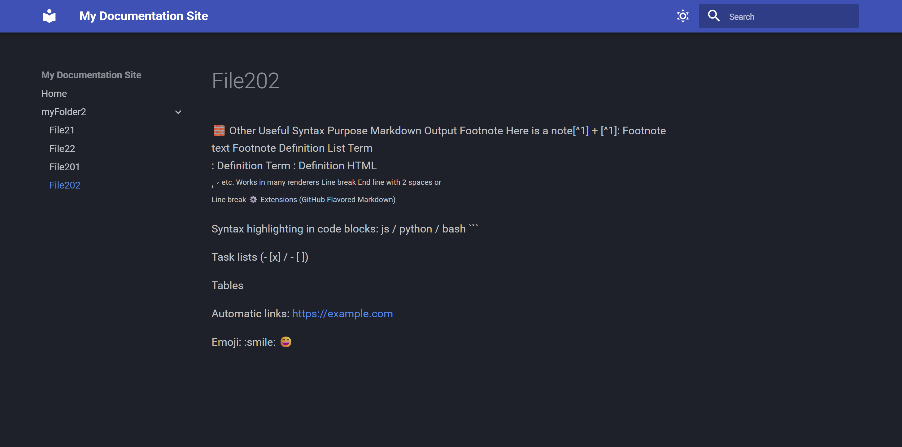

<h1 align="center">🧩 WFORK-Docs</h1>

  Документация и шпаргалки нашей секты

  <!-- GitHub badges -->
  
  
  

## 🚀 Live Website

> **Try it instantly:**  
> https://docs.weforks.org/

## 📸 Preview

  

## ⚙️ RUN

docker compose up -d --build 

## 🤝 Contributing

Fork → branch → commit feat/fix

  
DEV Log

- [x] v0.0.2 - create auto update and rebuild
- [x] v0.0.1 - создан docker mkdocs

  
Github CHEATSHEET

## Update repository

git add .
git commit -m "v0.0.2 - create auto update and rebuild"
git push

## 📄 License

Licensed under the MIT License.

Made with ❤️ &nbsp;

